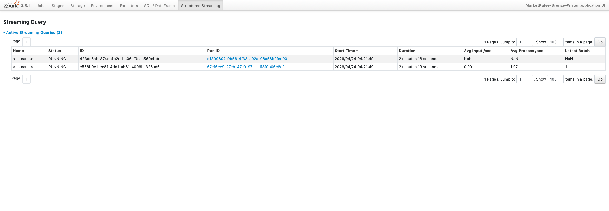

# Market-Intelligence-Pipeline

NewsAPI (HTTP pull)  ─┐
                       ├──► Kafka topics ──► Spark Structured Streaming ──► Delta Lake (bronze)
yfinance (HTTP pull) ─┘

market-pulse/
├── .env                          # secrets, never commit this
├── .gitignore
├── docker-compose.yml
├── producer/
│   ├── Dockerfile
│   ├── requirements.txt
│   └── producer.py
├── spark/
│   └── streaming_consumer.py     # no Dockerfile needed, using bitnami image directly
├── delta_lake/                   # auto-created, gitignored
│   ├── bronze/
│   │   ├── news/
│   │   └── prices/
│   └── checkpoints/
└── README.md

market-pulse/
├── silver/
│   └── silver_transform.py       # PySpark batch job
├── dbt/
│   ├── profiles.yml               # dbt connection config
│   ├── dbt_project.yml
│   └── models/
│       ├── gold_daily_sentiment.sql
│       └── gold_price_anomaly_flags.sql
├── airflow/                       # astro project lives here
│   ├── dags/
│   │   └── market_pulse_dag.py
│   └── (astro-generated files)